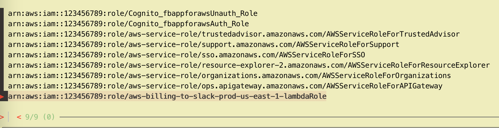

# assume role
> List down the available roles with a [fzf](https://github.com/junegunn/fzf) selector and assumes the selected role and automatically updates environment variables
# setup
- add the function to `.bashrc` or `.zshrc`
- Install [fzf](https://github.com/junegunn/fzf)

## Usage

```sh
$ assumerole
```
