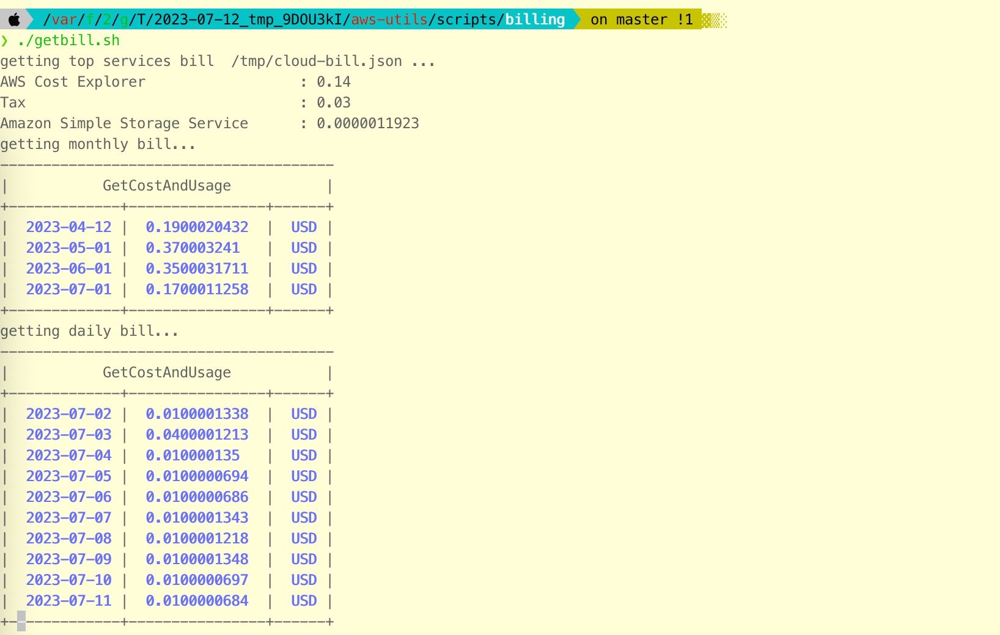

## Get AWS cost and usage summary on terminal

Get a short summary of cost and usage . Useful for quick checks while working with some POCs.



## Usage
```bash
./getbill.sh
```


## Notes
- Cost and usage API calls are billable.
    - The [pricing](https://aws.amazon.com/aws-cost-management/aws-cost-explorer/pricing/) is negligle compared to the charges when it might go unnoticed.
    - When there are too many resources, pagination might be used in api calls.